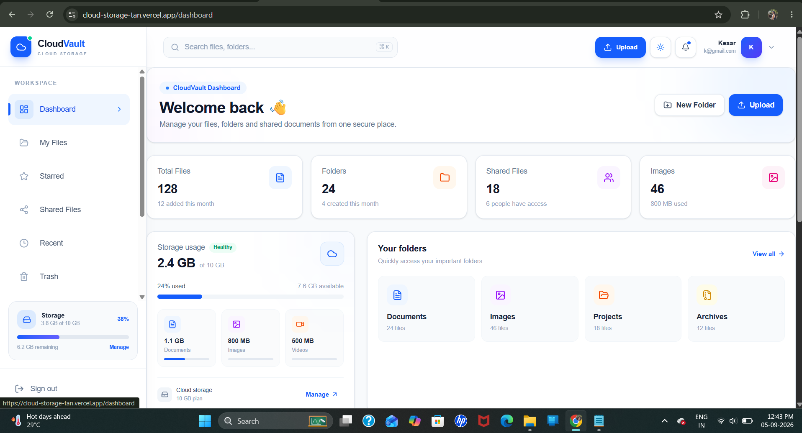
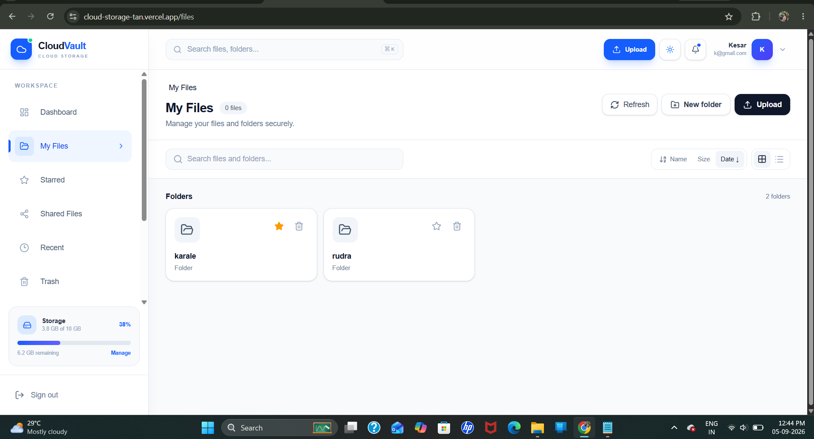
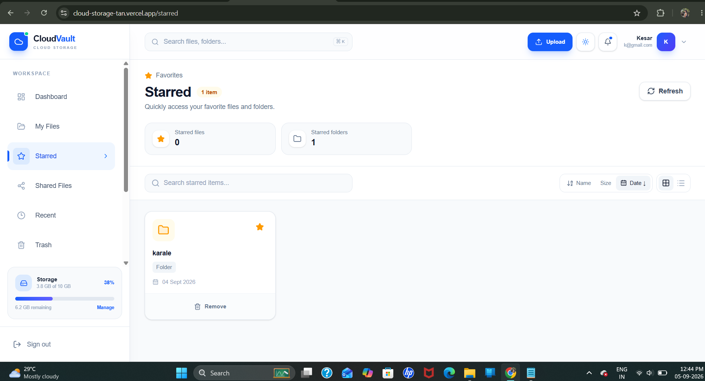
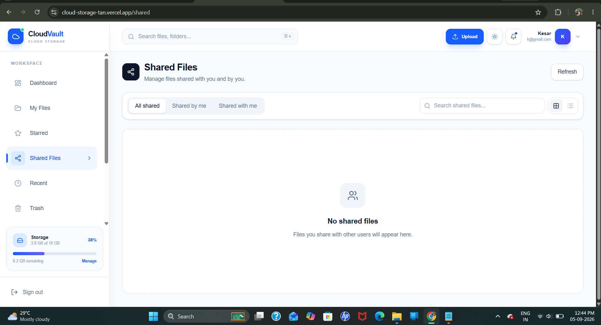
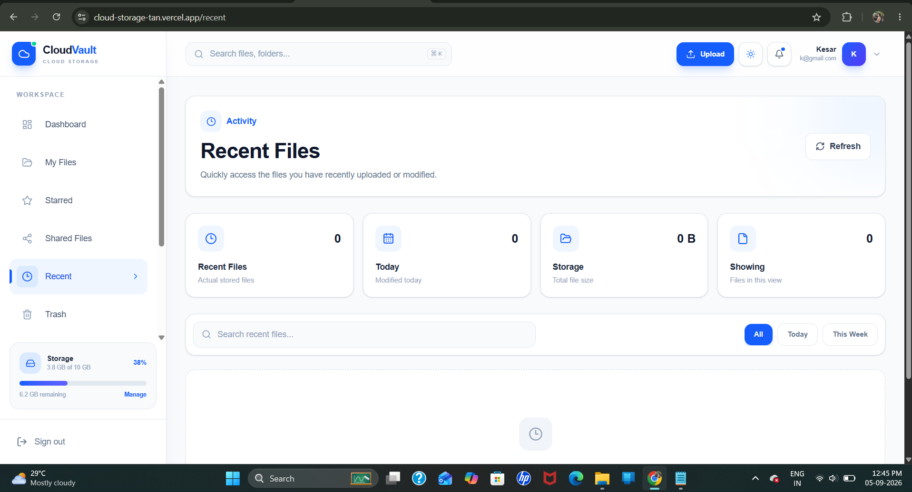
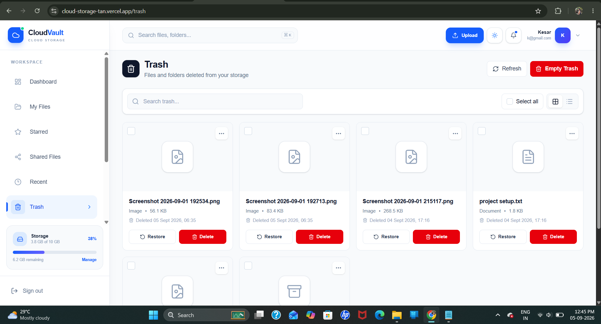
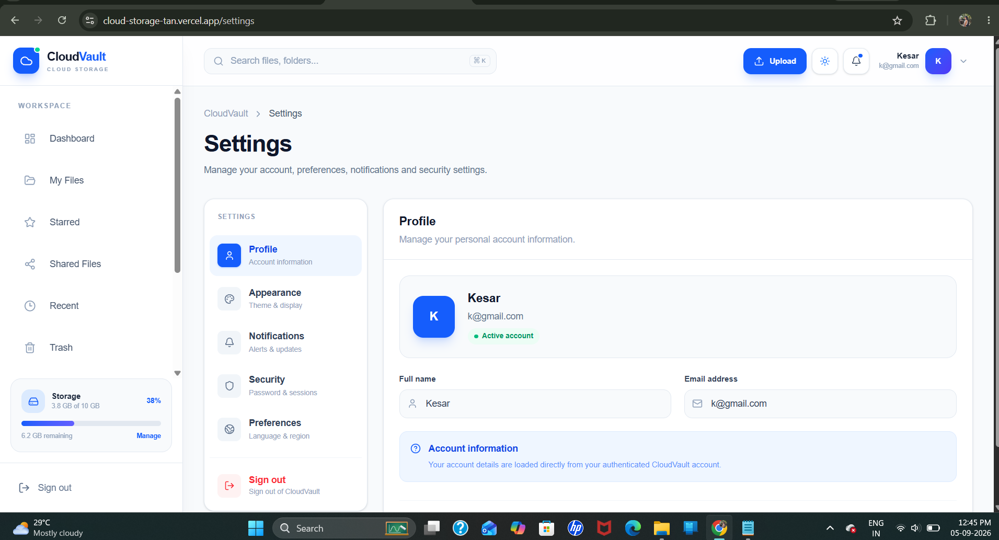

# ☁️ CloudVault – Cloud Storage

CloudVault is a modern and secure cloud storage web application that allows users to upload, manage, organize, download, and delete their files through a clean and responsive dashboard.

The project is built using **Next.js, TypeScript, Tailwind CSS, Spring Boot, PostgreSQL and JWT Authentication**.

---

## 🚀 Features

### 🔐 Authentication
- User Registration
- User Login
- JWT-based Authentication
- Current User Profile
- Secure Logout
- Protected API endpoints

### 📁 File Management
- Upload files
- View uploaded files
- Download files
- Delete files
- File type detection
- File size display
- Recent files
- File search
- Grid/List view

### 📂 Folder Management
- Create folders
- Organize files into folders
- Folder navigation
- Folder-based file organization

### ⭐ File Organization
- Starred files
- Recent files
- Shared files
- Trash management

### 🎨 Modern UI
- Professional dashboard
- Light/Dark mode
- Responsive design
- Mobile sidebar
- Modern cards and modals
- Toast notifications
- User profile dropdown
- Notification panel
- Responsive file management interface

### 🛡️ Security
- JWT authentication
- Protected APIs
- Stateless authentication
- Secure backend architecture
- PostgreSQL database

---

## 🛠️ Tech Stack

### Frontend

- Next.js
- React
- TypeScript
- Tailwind CSS
- Lucide React Icons

### Backend

- Java 21
- Spring Boot
- Spring Security
- JWT
- Spring Data JPA
- Hibernate

### Database

- PostgreSQL

### Development Tools

- Git
- GitHub
- Maven
- npm

---

## 🏗️ Project Architecture

```text
CloudVault
│
├── frontend/
│   ├── app/
│   │   ├── dashboard/
│   │   ├── files/
│   │   ├── recent/
│   │   ├── starred/
│   │   ├── shared/
│   │   ├── trash/
│   │   ├── settings/
│   │   └── login/
│   │
│   ├── components/
│   │   ├── DashboardShell.tsx
│   │   ├── FileCard.tsx
│   │   └── StorageCard.tsx
│   │
│   └── ...
│
└── backend/
    ├── src/
    │   └── main/
    │       ├── java/
    │       │   └── com.example.demo/
    │       │       ├── controller/
    │       │       ├── service/
    │       │       ├── repository/
    │       │       ├── model/
    │       │       ├── security/
    │       │       └── config/
    │       │
    │       └── resources/
    │           └── application.properties
    │
    └── pom.xml
```

## 🔑 Authentication Flow

User
 │
 ▼
Login / Register
 │
 ▼
Spring Boot Authentication
 │
 ▼
JWT Token
 │
 ▼
Frontend Local Storage
 │
 ▼
Protected API Requests
 │
 ▼
Spring Security
 │
 ▼
Authenticated User

 ---

## 📸 Screenshots

* **Dashboard**
  
  
  
  * **My File**
  
  
  
  * **Starred File**
  
  

  * **Shared File**
  
  
  
  * **Recent**
  
  
  
  * **Trash Bin**
  
  

 * **Setting**
  
  


---

## 🎥 Demo

Watch the complete CloudVault application demo:

Demo Video:
           ** https://cloud-storage-tan.vercel.app**
---

## 🌟 Main User Flow

Register                                                                                
   ↓                                                                                                                     
Login                                                                                            
   ↓                                                                                      
Dashboard                                                                                        
   ↓                                                                                       
Upload File                                                                                  
   ↓                                                                                                  
Create Folder                                                                                                  
   ↓                                                                                                  
Manage Files                                                                                             
   ↓                                                                                                 
Download / Delete                                                                                              
   ↓                                                                                                     
Recent / Starred / Shared                                                                                          
   ↓                                                                                                  
Settings                                                              

## 📱 Responsive Design

CloudVault is designed to work across:

💻 Desktop                                                                               
💻 Laptop                                                               
📱 Mobile                                                                    
📟 Tablet                                                                           

The dashboard automatically adapts to different screen sizes.

## 🔮 Future Improvements

File sharing with users                                                 
Email-based file sharing                                                  
Cloud storage usage calculated from real files                                              
Persistent notification system                                                  
Password change functionality                                                  
Account deletion                                                                
File preview                                                       
Image gallery                                                       
Video preview                                                                       
Search optimization                                                                           
Storage quota management                                                                    
Admin dashboard                                                        
Cloud deployment                                                 

**GitHub:**
https://github.com/Kesarkarale/cloud-vault

## ⭐ Support

If you like this project, consider giving it a ⭐ on GitHub.

## 📄 License

This project is developed for educational and portfolio purposes.

##  👨‍💻 Developed By

Kesar Karale
